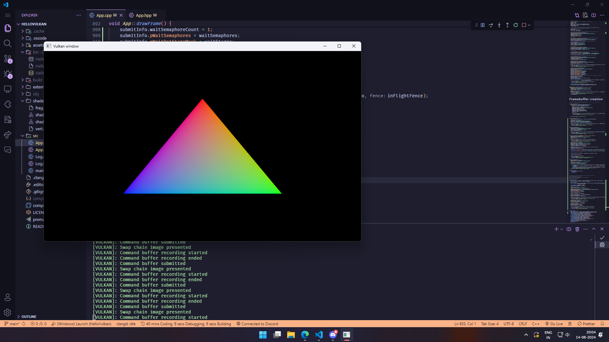

This is me learning vulkan from [https://vulkan-tutorial.com/](https://vulkan-tutorial.com/)

The code is heavily documented (basically, I took notes for my own understanding).

## Project journal

### 14.08.2024: My very first Vulkan triangle!

After 4 days of learning, and 925 lines of code, I finally got something on the screen.



## Building the source code

```bash
# Meta build (any of these)
premake5 ninja --cc=clang
premake5 ninja --cc=gcc
premake5 gmake2

# Build
ninja -C build   # or make -C build

# compile_commands.json
premake5 ecc

# Compile shaders
./compile_shaders.bat

# Run
./bin/Debug/HelloVulkan
```
